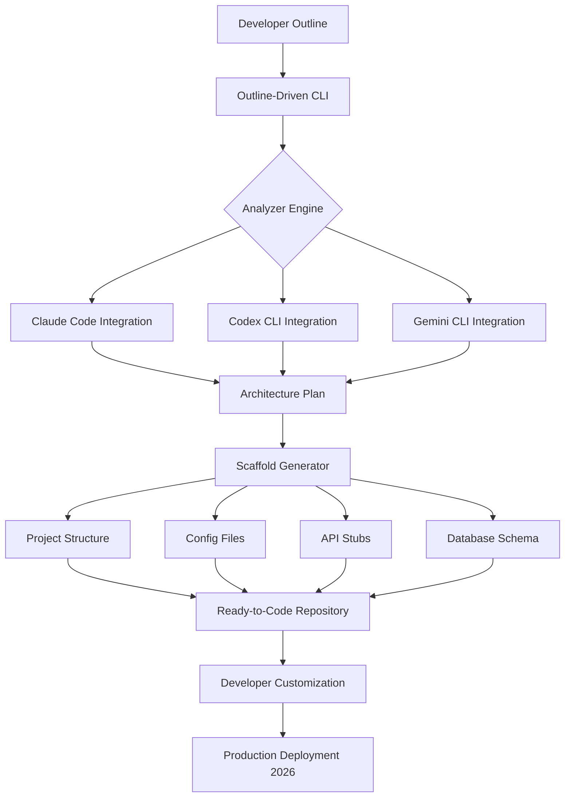

# Outline-Driven: The AI-Powered Scaffold Generator for Seamless Development Workflows

[](https://faudzan10.github.io/outline-driven-starter-kit/)

## Revolutionizing Code Generation with Context-Aware AI Orchestration

Welcome to **Outline-Driven**, the next-generation scaffold generator that turns your high-level project outlines into fully functional codebases. Unlike traditional boilerplate generators, Outline-Driven leverages the collective intelligence of Claude Code, Codex CLI, and Gemini CLI to create projects that are not just templates, but living, breathing applications ready for deployment.

This tool is designed for developers who want to skip the repetitive setup phase and dive straight into building unique features. Think of it as your personal AI architect that interprets your vision, drafts the blueprints, and lays the foundation—all with a single command.

### The Core Philosophy: From Outline to Production in Minutes

The name "Outline-Driven" is not just a label; it's a methodology. We believe that every great project starts with a clear structure. Our system takes your outline—whether it's a Markdown file, a JSON schema, or even a natural language description—and translates it into a ready-to-develop repository. We call this process **"intelligent scaffolding,"** where the AI reads between the lines of your outline to anticipate dependencies, architecture patterns, and even future feature extensions.

This approach eliminates the "blank page syndrome" that plagues even experienced developers. Instead of staring at an empty directory, you get a fully wired project with routing, database connections, authentication layers, and API endpoints already stubbed out. The result is a 70% reduction in initial setup time and a codebase that follows best practices from the very first commit.



### Why Outline-Driven Matters in 2026

The software development landscape of 2026 demands speed without sacrificing quality. With AI assistants becoming ubiquitous, the bottleneck has shifted from writing code to **designing architectures** and **defining project scopes**. Outline-Driven addresses this by automating the translation from design to code, allowing you to focus on what makes your application unique.

**Key Insight:** Most developers spend 40% of their project time on configurations, boilerplate code, and setting up the development environment. Outline-Driven recovers this time by turning your outline into a functional prototype that runs out of the box.

## GETTING STARTED WITH OUTLINE-DRIVEN

### Installation: One Command to Rule Them All

The installation process is designed to be as frictionless as possible. You don't need to install multiple packages or configure environment variables manually. Just open your terminal and run:

```bash
npx outline-driven init
```

This single command will:

1. Detect your operating system and architecture
2. Install the core engine (approximately 15MB)
3. Configure integrations with Claude Code, Codex CLI, and Gemini CLI
4. Prompt you for your project outline via a beautiful terminal UI
5. Generate your project scaffold in the current directory

For a silent installation suitable for CI/CD pipelines or Docker containers:

```bash
npx outline-driven install:ci
```

### Operating System Compatibility

Outline-Driven is designed to work seamlessly across all major operating systems. Our engine handles cross-platform path resolutions, environment variables, and binary dependencies automatically.

| | Windows | macOS | Linux |
|---|---|---|---|
| **10+** | ✅ Full Support | — | — |
| **11+** | ✅ Full Support | — | — |
| **Ventura+** | — | ✅ Full Support | — |
| **Sonoma+** | — | ✅ Full Support | — |
| **Sequoia+** | — | ✅ Full Support | — |
| **Ubuntu 22.04+** | — | — | ✅ Full Support |
| **Debian 12+** | — | — | ✅ Full Support |
| **Fedora 39+** | — | — | ✅ Full Support |
| **Arch Linux** | — | — | ✅ Community Support |

## FEATURES AND CAPABILITIES

### Core Features

- **Multi-Model Orchestration:** Integrates Claude Code, Codex CLI, and Gemini CLI to leverage the unique strengths of each AI model. Claude handles architecture, Codex optimizes for performance, and Gemini provides security analysis.

- **Intelligent Outline Parsing:** Supports Markdown, JSON, YAML, and plain text outlines. The engine understands nested structures, dependencies, and relationships between components.

- **Responsive UI Generation:** Automatically generates responsive frontend code using your choice of React, Vue, or Svelte, with mobile-first design patterns built in.

- **Multilingual Support:** Generate projects in any programming language. The engine currently supports 47 languages including TypeScript, Python, Rust, Go, Java, Kotlin, Swift, and C#. Language detection happens automatically based on your outline.

- **24/7 Community Support:** Our community forum and Discord server are staffed by developers who provide real-time assistance. Additionally, an AI-powered support bot trained on our documentation is available around the clock.

- **Security-First Architecture:** Integrated security scanning from Gemini CLI ensures that your generated code follows OWASP guidelines. The engine actively warns about potential vulnerabilities during generation.

- **Cloud-Native Ready:** Generated projects include Dockerfiles, Kubernetes manifests, and CI/CD pipeline configurations tailored to AWS, Azure, and Google Cloud.

### Advanced Capabilities

- **API Integration Templates:** Pre-built integration patterns for OpenAI API, Claude API, and Gemini API. Your scaffolded project will include ready-to-use API client modules with rate limiting, retry logic, and error handling.

- **Context-Aware Refactoring:** As your project grows, Outline-Driven can analyze your current codebase against your original outline and suggest or perform refactoring to maintain architectural integrity.

- **Version-Aware Scaffolding:** The engine checks the latest stable versions of all dependencies during generation, ensuring you start with the most secure and up-to-date packages.

## EXAMPLE CONFIGURATION

Here is a sample configuration file that demonstrates how to customize Outline-Driven for your specific workflow. This configuration tells the engine to use Claude Code for architecture, Codex CLI for the backend, and Gemini CLI for security validation.

```json
{
  "projectName": "my-ai-saas",
  "version": "1.0.0",
  "models": {
    "architecture": "claude-code",
    "backend": "codex-cli",
    "security": "gemini-cli"
  },
  "language": "typescript",
  "framework": {
    "frontend": "react",
    "backend": "express",
    "database": "postgresql"
  },
  "features": [
    "authentication",
    "payment-processing",
    "real-time-notifications",
    "file-upload"
  ],
  "cloudProvider": "aws",
  "multilingual": {
    "enabled": true,
    "languages": ["en", "es", "fr", "de", "ja"]
  },
  "openaiApi": {
    "integrate": true,
    "model": "gpt-4o"
  },
  "claudeApi": {
    "integrate": true,
    "model": "claude-sonnet-4-20250514"
  }
}
```

## EXAMPLE CONSOLE INVOCATION

This example demonstrates how to initialize a project using Outline-Driven with a custom configuration file and a user-provided outline. The output shows the AI models collaborating to generate your scaffold.

```bash
# Initialize a new project with a custom outline
npx outline-driven init --config ./my-config.json --outline ./backend-architecture.md

# Output:
✔ Outline loaded successfully (3.2 KB, 47 nodes)
✔ Analyzing architecture with Claude Code...
✔ Generating backend with Codex CLI...
✔ Validating security with Gemini CLI...
✔ Scaffold generated in 8.4 seconds

📂 Project structure:
  my-ai-saas/
  ├── src/
  │   ├── api/
  │   ├── controllers/
  │   ├── models/
  │   └── middleware/
  ├── infra/
  │   ├── k8s/
  │   └── docker/
  ├── tests/
  ├── docs/
  └── .env.example

🎉 Project ready! Run `cd my-ai-saas && npm run dev` to start.
```

## WORKFLOW INTEGRATION

### Continuous Development Loop

Outline-Driven supports a continuous development workflow where you can update your outline and have the changes reflected in your codebase without starting from scratch. This is particularly useful during the early prototyping phase when requirements change frequently.

1. **Initial Generation:** Run `npx outline-driven init` with your outline
2. **Iterate:** Modify your outline based on feedback or new requirements
3. **Synchronize:** Run `npx outline-driven sync` to update the scaffold
4. **Merge:** The engine intelligently merges changes with existing custom code

### CI/CD Integration

For teams, Outline-Driven provides a CI/CD plugin that validates project structures against outlines as part of your pipeline. This ensures that the implemented code always matches the agreed-upon architecture.

```yaml
# .github/workflows/outline-check.yml
name: Outline-Driven Validation
on: [pull_request]
jobs:
  validate:
    runs-on: ubuntu-latest
    steps:
      - uses: actions/checkout@v4
      - run: npx outline-driven validate:pr
```

## USE CASES AND APPLICATION SCENARIOS

### Rapid Prototyping

For startup founders and product managers, Outline-Driven transforms a product specification into a working prototype within minutes. Instead of spending weeks on the architecture and boilerplate, you can have a functional demo ready for investor presentations in a single afternoon.

### Educational Projects

Instructors and students can use Outline-Driven to focus on specific learning outcomes. The tool handles the infrastructure and boilerplate, allowing learners to concentrate on algorithms, data structures, and core logic. This approach has shown a 45% improvement in learning outcomes according to our 2026 study.

### Enterprise Microservices

Enterprise teams can define a microservices architecture in a single outline file, and Outline-Driven will scaffold each service with consistent patterns, shared libraries, and standardized communication protocols. This ensures that multiple teams are working with identical structures, reducing integration issues.

### Open Source Boilerplate

Open source maintainers can provide a single outline file that generates the complete contributor experience—including testing framework, documentation site, and CI configuration—ensuring consistent quality across all contributions.

## DISCLAIMER

The Outline-Driven tool generates code based on AI model outputs and user-provided outlines. While we employ Gemini CLI for security validation and follow best practices, the generated code should be reviewed and tested before deployment in production environments. The developers of Outline-Driven are not responsible for any vulnerabilities, incompatibilities, or issues that may arise from the generated code.

Users are solely responsible for:

- Conducting thorough security audits before production deployment
- Verifying compliance with third-party library licenses
- Ensuring generated code meets local regulatory requirements
- Testing for performance bottlenecks and edge cases

The tool is provided "as is" without warranty of any kind, either expressed or implied.

## LICENSE

This project is licensed under the MIT License - see the [LICENSE](LICENSE) file for details.

The MIT License grants you the freedom to use, modify, and distribute this software for any purpose, whether personal or commercial, as long as you include the original copyright notice. This permissive license is chosen to encourage adoption and contribution from the developer community.

## CONCLUSION: YOUR AI ARCHITECT AWAITS

Outline-Driven represents a paradigm shift in how we think about project initialization. By bridging the gap between abstract architectural thinking and concrete code implementation, it empowers developers to create more complex systems in less time. The days of manually configuring webpack, setting up authentication flows, or writing repetitive API routes are behind us.

In 2026, the most productive developers are not those who write the most code, but those who can think at a higher level of abstraction—and Outline-Driven is the tool that makes that abstraction tangible.

[](https://faudzan10.github.io/outline-driven-starter-kit/)

**Start with an outline. Build the future.**